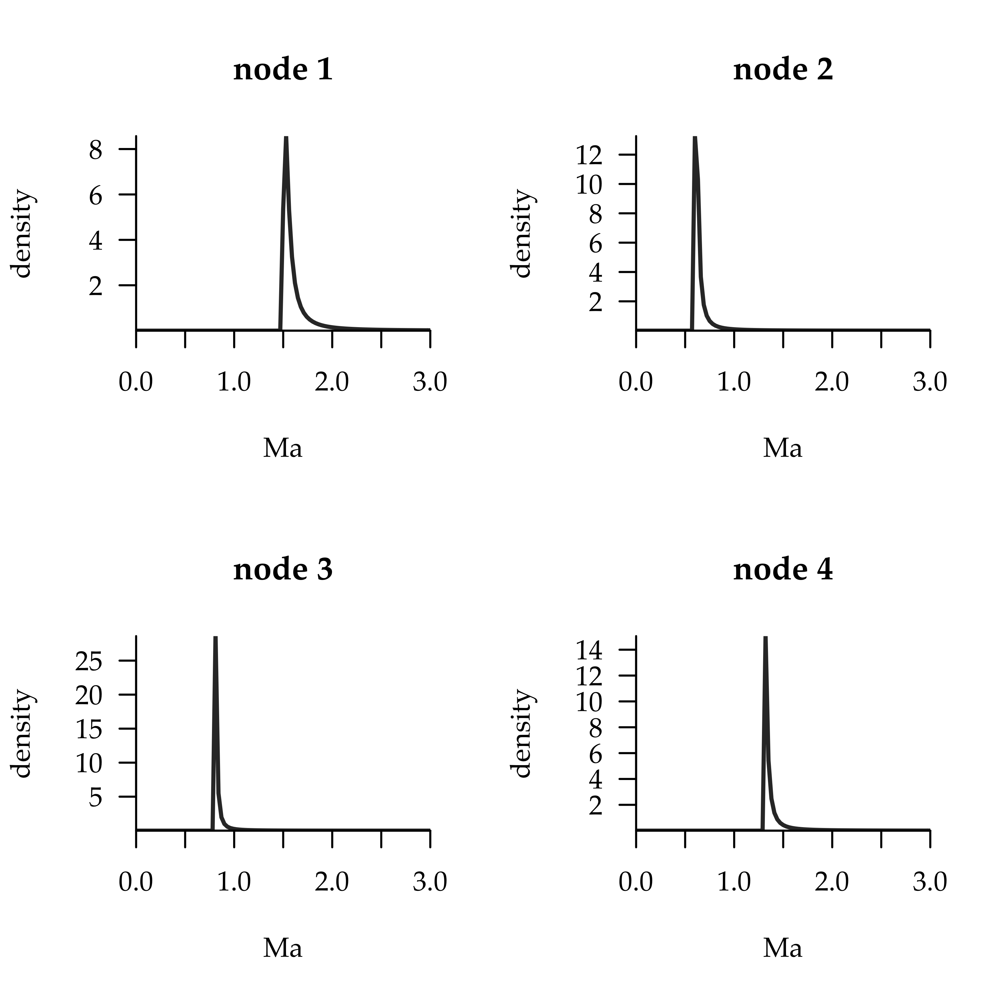
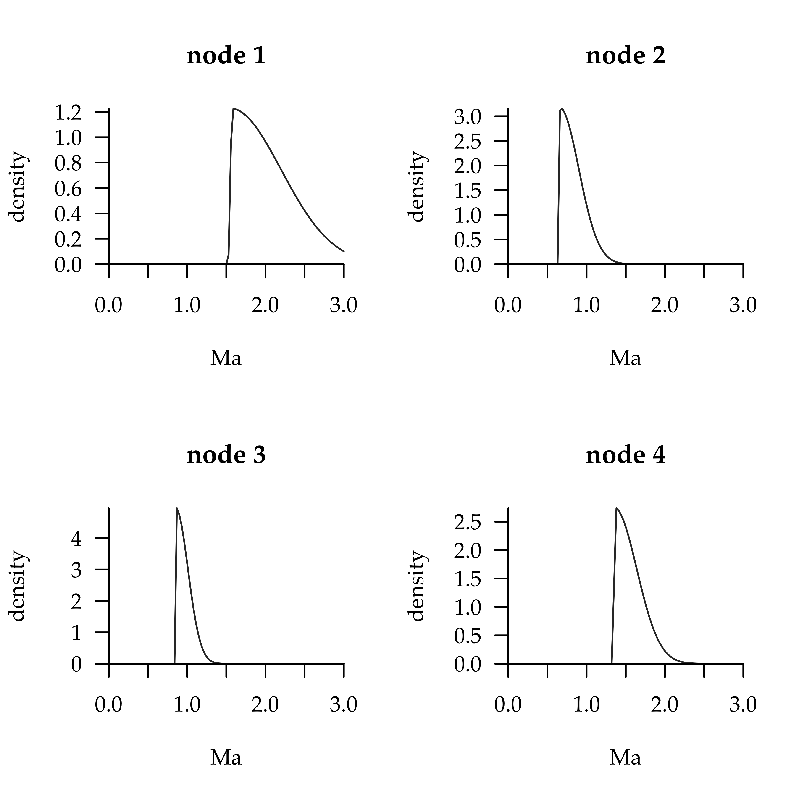
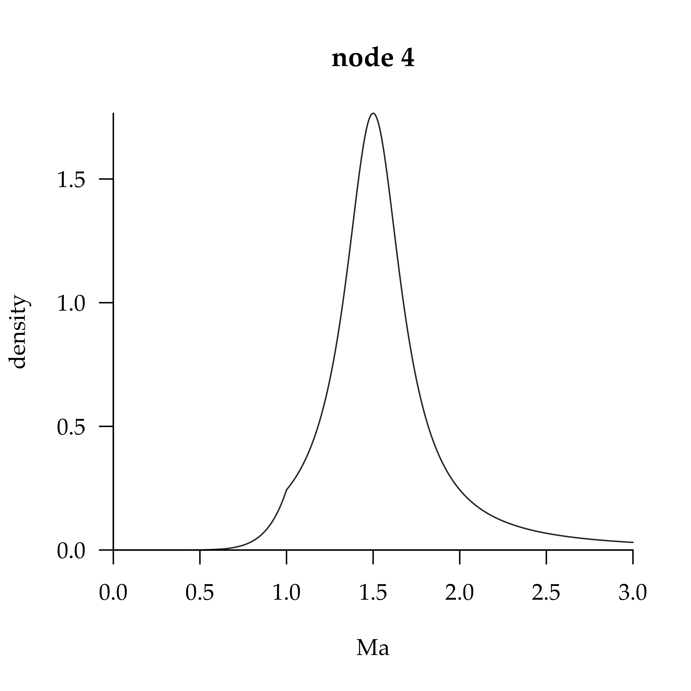
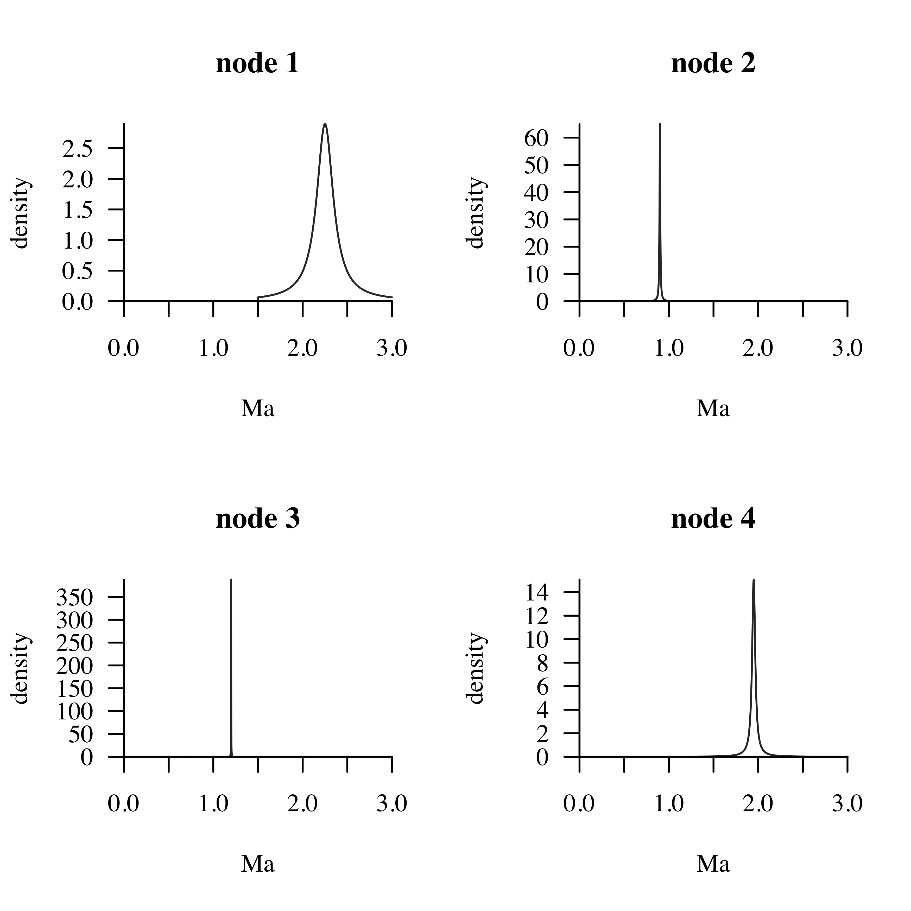
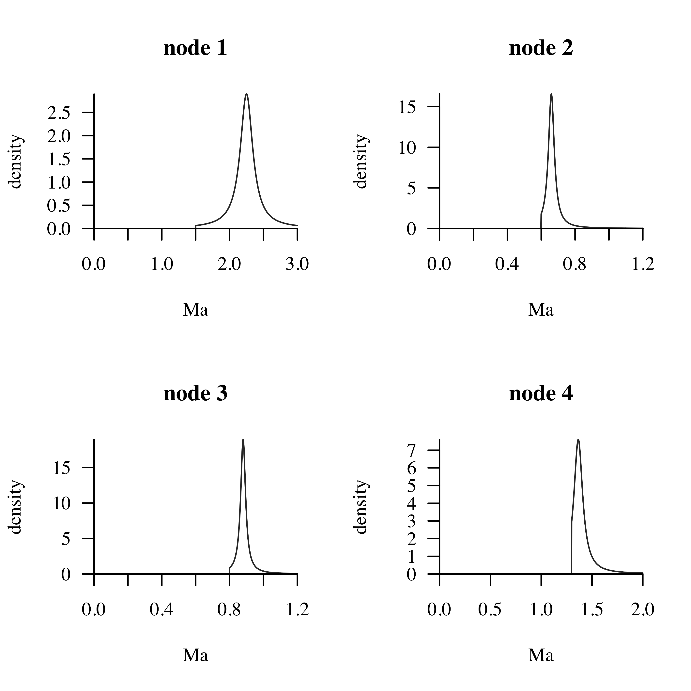
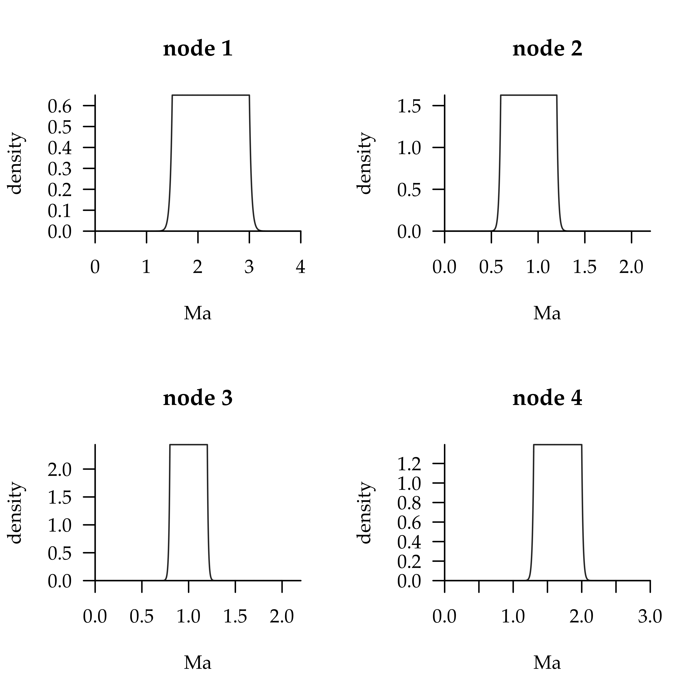
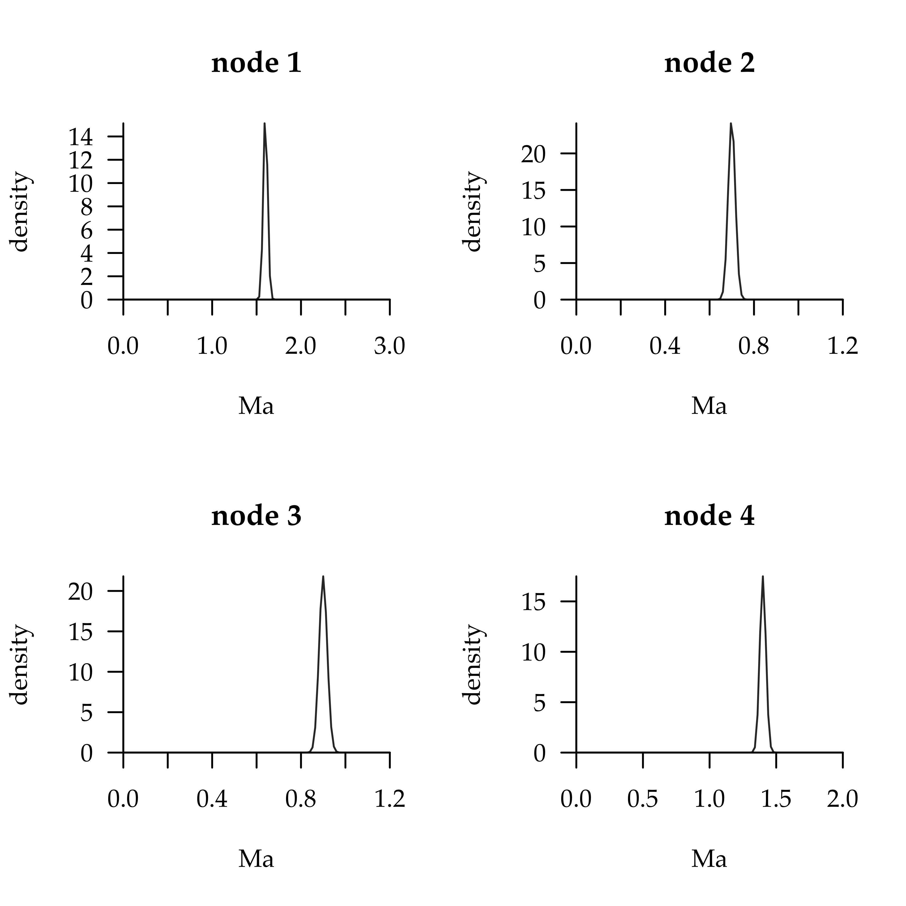

<!DOCTYPE html>

<html xmlns="http://www.w3.org/1999/xhtml">

<head>

<meta charset="utf-8" />
<meta http-equiv="Content-Type" content="text/html; charset=utf-8" />
<meta name="generator" content="pandoc" />

<title>MCMCTreeR</title>
<h1 class="title toc-ignore">MCMCTreeR</h1>

<a href="http://abacus.gene.ucl.ac.uk/software/paml.html">mcmctree</a> is a Bayesian program contained in the software paml to estimate divergence times on fixed topologies using molecular data developed by Ziheng Yang. The program requires various inputs from the user: a phylogeny, molecular data, and selected model parameters.

A vital part of divergence time estimation in a Bayesian context are priors placed on nodes that are used to reflect <strong>a priori</strong> knowledge on when those lineages diverged. The guide here for mcmctreer is designed to help choose the best parameters to reflect age information for prior age distributions, visualise priors, and output files that can be read into mcmctree for analysis.

This guide does not include details about which priors are appropriate for the data, etc, so please see the <a href="http://abacus.gene.ucl.ac.uk/software/pamlDOC.pdf">mcmctree manual</a>.

<h1>Installation</h1>
<pre class="r"><code>## uncomment if devtools not previously installed
## install.packages('devtools')
library(devtools)
# install_github('PuttickMacroevolution/MCMCTreeR')
library(MCMCTreeR)</code></pre>
<pre><code>## Loading required package: ape</code></pre>
<pre><code>## Loading required package: sn</code></pre>
<pre><code>## Loading required package: stats4</code></pre>
<pre><code>## 
## Attaching package: 'sn'</code></pre>
<pre><code>## The following object is masked from 'package:stats':
## 
##     sd</code></pre>
<pre><code>## Loading required package: coda</code></pre>

For the examples here, the data are a phylogeny of apes <code>apeTree</code>. Also contained in the data are the minimum ages <code>minimumTimes</code> and maximum ages <code>maximumTimes</code> for nodes, and the tip labels descending from each node <code>monophyleticGroups</code>. These example data can be substituted for other data

<pre class="r"><code>data(apeData)
attach(apeData)
names(apeData)</code></pre>
<pre><code>## [1] &quot;minimumTimes&quot;       &quot;maximumTimes&quot;       &quot;monophyleticGroups&quot;
## [4] &quot;apeTree&quot;</code></pre>

<h1>Estimate parameters for node input parameters</h1>

This section includes information to estimate and plot prior age distributions for node(s) used in mcmctree divergence time estimation. The data required to do this is a phylogeny, minimum and maximum ages for the nodes with prior distributions, and taxa that descend from each node.

The code can be used to simultanaeouly estimate the parameter values and write files. This can be done across the whole tree with a specific type of distribution placed on each node, or by placing different constraints on different nodes.

By default the code here estimates the parameters that are needed for a distribution the spans from the a minimum bound (lower age) to an maximum bound (upper age). The distributions are treated so there is a ‘hard’ minimum and ‘soft maximum’, and 97.5% of the distribution falls between the minimum and maximum ages. The code can estimate paramaters for the caucy, skew-t, skew-normal, and gamma distirbutions shown in the <a href="http://abacus.gene.ucl.ac.uk/software/pamlDOC.pdf">mcmctree manual</a> on page 50.

<h2>Skew T</h2>

<h3>estimate scale with a given shape</h3>

In this estimateSkewT function the default assumes we want to estimate scale with a given shape value (the default shape value is 50). The result parameters show the input for the mcmctree format - the location (lower node age), scale, shape, and degrees of freedom

<pre class="r"><code>skewT_results &lt;- estimateSkewT(minAge = minimumTimes, maxAge = maximumTimes, 
    monoGroups = monophyleticGroups, phy = apeTree, plot = FALSE)</code></pre>
<pre><code>## [1] &quot;warning - minProb parameter value recycled&quot;
## [1] &quot;warning - maxProb parameter value recycled&quot;
## [1] &quot;warning - estimateScale argument recycled&quot;
## [1] &quot;warning - estimateShape argument recycled&quot;
## [1] &quot;warning - estimateMode argument recycled&quot;
## [1] &quot;warning - shape parameter value recycled&quot;
## [1] &quot;warning - addMode parameter value recycled&quot;</code></pre>
<pre class="r"><code>skewT_results$mcmctree</code></pre>
<pre><code>##      
## 1 7 1
##                                                                                                                                                         
## 1 ((((human,(chimpanzee,bonobo))'ST(0.8,0.016,50,1)',gorilla)'ST(0.6,0.024,50,1)',(orangutan,sumatran)'ST(1.3,0.028,50,1)'),gibbon)'ST(1.5,0.059,50,1)';
##                
## 1 //end of file</code></pre>

The function <code>plotMCMCTree</code> plots the age distribution that will be used as the user, applied distribution for each node.

<pre class="r"><code>par(mfrow = c(2, 2), family = &quot;Palatino&quot;)
for (i in 1:4) plotMCMCTree(skewT_results$parameters[i, ], method = &quot;skewT&quot;, 
    title = paste0(&quot;node &quot;, i), upperTime = max(maximumTimes))</code></pre>

Skew T distributions for all nodes

<pre class="r"><code>skewT_results$mcmctree</code></pre>
<pre><code>##      
## 1 7 1
##                                                                                                                                                         
## 1 ((((human,(chimpanzee,bonobo))'ST(0.8,0.016,50,1)',gorilla)'ST(0.6,0.024,50,1)',(orangutan,sumatran)'ST(1.3,0.028,50,1)'),gibbon)'ST(1.5,0.059,50,1)';
##                
## 1 //end of file</code></pre>

If the distributions are acceptable, the output is written into a tree file ready to be input into mcmctree using the <code>writeMCMCtree</code> argument, and set the name in the<code>mcmcTreeName</code> argument. Additionally, we could have requested a pdf output of the estimate distributions by using <code>plot=TRUE</code> and specifying the file of this name using the <code>pdfOutput</code> argument

<pre class="r"><code># result in tree MCMCTree format
skewT_results$mcmctree</code></pre>
<pre><code>##      
## 1 7 1
##                                                                                                                                                         
## 1 ((((human,(chimpanzee,bonobo))'ST(0.8,0.016,50,1)',gorilla)'ST(0.6,0.024,50,1)',(orangutan,sumatran)'ST(1.3,0.028,50,1)'),gibbon)'ST(1.5,0.059,50,1)';
##                
## 1 //end of file</code></pre>
<pre class="r"><code>## not run skewT_results &lt;- estimateSkewT(minAge=minimumTimes,
## maxAge=maximumTimes, monoGroups=monophyleticGroups,
## phy=apeTree, plot=FALSE, pdfOutput='skewTPlot.pdf',
## writeMCMCTree=TRUE, mcmcTreeName='skewTInput.tre')</code></pre>

It is not necessary to specify the same shape value for each parameter: a different value of shape can be set for each distribution

<pre class="r"><code>## not run (remove ## to run) skewT_results &lt;-
## estimateSkewT(minAge=minimumTimes, maxAge=maximumTimes,
## monoGroups=monophyleticGroups, shape=c(9, 10, 8, 10),
## phy=apeTree, plot=TRUE, pdfOutput='skewTPlot.pdf',
## writeMCMCTree=TRUE, mcmcTreeName='skewTInput.tre')
## skewT_results$parameters</code></pre>

<h3>estimate shape with a given scale</h3>

The function will take input minimum input times, and estimate the value of the shape that will produce the desired distribution with a scale equal to 0.05

<pre class="r"><code>skewT_results &lt;- estimateSkewT(minAge = minimumTimes[2], maxAge = maximumTimes[2], 
    monoGroups = monophyleticGroups, scale = 0.05, estimateShape = TRUE, 
    estimateScale = FALSE, phy = apeTree, plot = FALSE, writeMCMCTree = FALSE)
skewT_results$parameters</code></pre>
<pre><code>##        location scale shape df
## node_1      0.6  0.05     1  1</code></pre>

<h2>Skew normal</h2>

The function will take input minimum input times, and estimate the value of the scale that will produce a skew normal distribution with the 97.5% cumulative probability of the distribution at the maximum age.

<pre class="r"><code>skewNormal_results &lt;- estimateSkewNormal(minAge = minimumTimes, 
    maxAge = maximumTimes, monoGroups = monophyleticGroups, addMode = 0.05, 
    phy = apeTree, plot = FALSE)</code></pre>
<pre><code>## [1] &quot;warning - minProb parameter value recycled&quot;
## [1] &quot;warning - maxProb parameter value recycled&quot;
## [1] &quot;warning - estimateScale argument recycled&quot;
## [1] &quot;warning - estimateShape argument recycled&quot;
## [1] &quot;warning - estimateMode argument recycled&quot;
## [1] &quot;warning - shape parameter value recycled&quot;
## [1] &quot;warning - addMode parameter value recycled&quot;</code></pre>
<pre class="r"><code>skewNormal_results$parameters</code></pre>
<pre><code>##        location scale shape
## node_1     1.55  0.65    50
## node_2     0.65  0.25    50
## node_3     0.85  0.16    50
## node_4     1.35  0.29    50</code></pre>

As only a single value is provided for each parameter, the function outputs warnings to indicate these values are recycled for each node.

These skew normal distributions can be plotted to the screen

<pre class="r"><code>par(mfrow = c(2, 2), family = &quot;Palatino&quot;)
for (i in 1:4) plotMCMCTree(skewNormal_results$parameters[i, 
    ], method = &quot;skewNormal&quot;, title = paste0(&quot;node &quot;, i), upperTime = max(maximumTimes))</code></pre>

Skew normal distributions for all nodes

<h2>Cauchy</h2>

plot example on page 50 of PAML manual

<pre class="r"><code>example_page_50 &lt;- estimateCauchy(minAge = 1, maxAge = 4.32, 
    monoGroups = monophyleticGroups[[1]], phy = apeTree, offset = 0.5, 
    minProb = 0.025, plot = FALSE)[[1]]
plotMCMCTree(example_page_50, method = &quot;cauchy&quot;, title = paste0(&quot;node &quot;, 
    i), upperTime = max(maximumTimes))</code></pre>

Cauchy distributions for all nodes (with a given scale)

<h3>estimate scale with a given shape</h3>

The function will take input minimum input times, and estimate the value of the scale that will produce a cauchy distribution with the 97.5% cumulative probability of the distribution at the maximum age.

<pre class="r"><code>cauchy_results &lt;- estimateCauchy(minAge = minimumTimes, maxAge = maximumTimes, 
    monoGroups = monophyleticGroups, offset = 0.5, phy = apeTree, 
    plot = FALSE)</code></pre>
<pre><code>## [1] &quot;warning - minProb parameter value recycled&quot;
## [1] &quot;warning - maxProb parameter value recycled&quot;
## [1] &quot;warning - offset parameter value recycled&quot;
## [1] &quot;warning - scale parameter value recycled&quot;
## [1] &quot;warning - estimateScale argument recycled&quot;</code></pre>
<pre class="r"><code>cauchy_results$parameters</code></pre>
<pre><code>##         tL   p     c     pL
## node_1 1.5 0.5 0.075 1e-300
## node_2 0.6 0.5 0.008 1e-300
## node_3 0.8 0.5 0.001 1e-300
## node_4 1.3 0.5 0.016 1e-300</code></pre>
<pre class="r"><code>par(mfrow = c(2, 2), family = &quot;Times&quot;)
for (i in 1:4) plotMCMCTree(cauchy_results$parameters[i, ], method = &quot;cauchy&quot;, 
    title = paste0(&quot;node &quot;, i), upperTime = max(maximumTimes))</code></pre>

Cauchy distributions for all nodes (with a given shape)

We may have constrained our distribution too much for the 2nd, 3rd, and 4th distribution so we can modify that to allow for smaller offset.

<pre class="r"><code>cauchy_results &lt;- estimateCauchy(minAge = minimumTimes, maxAge = maximumTimes, 
    monoGroups = monophyleticGroups, offset = c(0.5, 0.1, 0.1, 
        0.05), phy = apeTree, plot = FALSE)</code></pre>
<pre><code>## [1] &quot;warning - minProb parameter value recycled&quot;
## [1] &quot;warning - maxProb parameter value recycled&quot;
## [1] &quot;warning - scale parameter value recycled&quot;
## [1] &quot;warning - estimateScale argument recycled&quot;</code></pre>
<pre class="r"><code>cauchy_results$parameters</code></pre>
<pre><code>##         tL    p     c     pL
## node_1 1.5 0.50 0.075 1e-300
## node_2 0.6 0.10 0.035 1e-300
## node_3 0.8 0.10 0.022 1e-300
## node_4 1.3 0.05 0.040 1e-300</code></pre>
<pre class="r"><code>par(mfrow = c(2, 2), family = &quot;Times&quot;)
for (i in 1:4) plotMCMCTree(cauchy_results$parameters[i, ], method = &quot;cauchy&quot;, 
    title = paste0(&quot;node &quot;, i), upperTime = maximumTimes[i])</code></pre>

Cauchy distributions for all nodes (with a given shape) and smaller offset

<h2>Uniform distribution</h2>
<pre class="r"><code>uniform_results &lt;- estimateBound(minAge = minimumTimes, maxAge = maximumTimes, 
    monoGroups = monophyleticGroups, phy = apeTree, plot = FALSE)</code></pre>
<pre><code>## [1] &quot;warning - minProb parameter value recycled&quot;
## [1] &quot;warning - maxProb parameter value recycled&quot;</code></pre>
<pre class="r"><code>uniform_results$parameters</code></pre>
<pre><code>##         tL  tU    pL    pU
## node_1 1.5 3.0 0.025 0.025
## node_2 0.6 1.2 0.025 0.025
## node_3 0.8 1.2 0.025 0.025
## node_4 1.3 2.0 0.025 0.025</code></pre>
<pre class="r"><code>par(mfrow = c(2, 2), family = &quot;Palatino&quot;)
for (i in 1:4) plotMCMCTree(uniform_results$parameters[i, ], 
    method = &quot;bound&quot;, title = paste0(&quot;node &quot;, i), upperTime = maximumTimes[i] + 
        1)</code></pre>

Uniform distributions for all nodes

<h2>Gamma distribution</h2>
<pre class="r"><code>gamma_results &lt;- estimateGamma(minAge = minimumTimes, maxAge = maximumTimes, 
    monoGroups = monophyleticGroups, alpha = 188, beta = 2690, 
    offset = 0.1, phy = apeTree, plot = FALSE)</code></pre>
<pre><code>## [1] &quot;warning - alpha parameter value recycled&quot;
## [1] &quot;warning - beta parameter value recycled&quot;
## [1] &quot;warning - offset parameter value recycled&quot;
## [1] &quot;warning - estimateAlpha argument recycled&quot;
## [1] &quot;warning - estimateBeta argument recycled&quot;</code></pre>
<pre class="r"><code>gamma_results$parameters</code></pre>
<pre><code>##        alpha beta
## node_1  4304 2690
## node_2  1883 2690
## node_3  2421 2690
## node_4  3766 2690</code></pre>
<pre class="r"><code>par(mfrow = c(2, 2), family = &quot;Palatino&quot;)
for (i in 1:4) plotMCMCTree(gamma_results$parameters[i, ], method = &quot;gamma&quot;, 
    title = paste0(&quot;node &quot;, i), upperTime = maximumTimes[i])</code></pre>

Gamma distributions for all nodes

<h2>Upper Age</h2>
<pre class="r"><code>upper_results &lt;- estimateUpper(maxAge = maximumTimes, monoGroups = monophyleticGroups, 
    rightTail = 0.025, phy = apeTree)</code></pre>
<pre><code>## [1] &quot;warning - maxProb parameter value recycled&quot;</code></pre>
<pre class="r"><code>upper_results$parameters</code></pre>
<pre><code>##         tU    pR
## node_1 3.0 0.025
## node_2 1.2 0.025
## node_3 1.2 0.025
## node_4 2.0 0.025</code></pre>

<h2>Fixed ages</h2>
<pre class="r"><code>fixed_results &lt;- estimateFixed(minAge = minimumTimes[1], monoGroups = monophyleticGroups[[1]], 
    phy = apeTree)
fixed_results</code></pre>
<pre><code>## $parameters
## fixed age.nodeOne 
##               1.5 
## 
## $apePhy
## 
## Phylogenetic tree with 7 tips and 6 internal nodes.
## 
## Tip labels:
##  human, chimpanzee, bonobo, gorilla, orangutan, sumatran, ...
## Node labels:
## [1] &quot;'=1.5'&quot;
## 
## Rooted; no branch lengths.
## 
## $mcmctree
##      
## 1 7 1
##                                                                               
## 1 ((((human,(chimpanzee,bonobo)),gorilla),(orangutan,sumatran)),gibbon)'=1.5';
##                
## 1 //end of file
## 
## $nodeLabels
## [1] &quot;'=1.5'&quot;</code></pre>

<h2>Different parameters on different nodes</h2>

If we want different parameters on different nodes we can specify this by using the function ‘mcmcTreePhy’. Here there are various distributions: a fixed root (node 1), skew normal (node 2), gamma (node 3), and upper distribution (node 4) to our tree. For each input we give the associated parameter values in a vector in the order of nodes. i.e - for the ‘min prob’ on four nodes we want nodes 1, 2, 4 to be 1e-8 and node 3 to be 0.025

<pre class="r"><code>each.node.method &lt;- c(&quot;skewT&quot;, &quot;cauchy&quot;, &quot;gamma&quot;, &quot;upper&quot;)
output.full &lt;- mcmcTreePhy(phy = apeTree, minAge = minimumTimes, 
    maxAge = maximumTimes, monoGroups = monophyleticGroups, method = each.node.method, 
    writeMCMCTree = FALSE)</code></pre>
<pre><code>## [1] &quot;length of some parameters and nodes do not match - first parameter will be used for each node&quot;</code></pre>

This can fine-tuned. For example, to estimate alpha not beta for the 3rd node

<pre class="r"><code>estimate.alpha &lt;- c(FALSE, FALSE, TRUE, FALSE)
estimate.beta &lt;- c(TRUE, TRUE, FALSE, TRUE)
outputFull &lt;- mcmcTreePhy(phy = apeTree, minAges = minimumTimes, 
    maxAges = maximumTimes, monoGroups = monophyleticGroups, 
    method = each.node.method, estimateAlpha = estimate.alpha, 
    estimateBeta = estimate.beta, alphaInput = 188, betaInput = 100, 
    writeMCMCTree = FALSE)</code></pre>
<pre><code>## [1] &quot;length of some parameters and nodes do not match - first parameter will be used for each node&quot;</code></pre>

Outputs from individual methods can be added to the input to subsequent node estimation. This allows for easier fine-tuning. Perhaps easier to explain with an example. A skew normal is applied to the first node

<pre class="r"><code>skewNormal_results_nodeOne &lt;- estimateSkewNormal(minAge = minimumTimes[1], 
    maxAge = maximumTimes[1], monoGroups = monophyleticGroups[[1]], 
    addMode = 0.05, phy = apeTree, plot = FALSE, writeMCMCTree = FALSE)
skewNormal_results_nodeOne$apePhy</code></pre>
<pre><code>## 
## Phylogenetic tree with 7 tips and 6 internal nodes.
## 
## Tip labels:
##  human, chimpanzee, bonobo, gorilla, orangutan, sumatran, ...
## Node labels:
## [1] &quot;'SN[1.55~0.65~50]'&quot;
## 
## Rooted; no branch lengths.</code></pre>

This output is then used when a Cauchy distribution is applied to the second node

<pre class="r"><code>cauchy_results_nodeTwo &lt;- estimateCauchy(minAge = minimumTimes[2], 
    maxAge = maximumTimes[2], monoGroups = monophyleticGroups[[2]], 
    offset = 0.5, phy = skewNormal_results_nodeOne$apePhy, plot = FALSE, 
    writeMCMCTree = FALSE)
cauchy_results_nodeTwo$apePhy</code></pre>
<pre><code>## 
## Phylogenetic tree with 7 tips and 6 internal nodes.
## 
## Tip labels:
##  human, chimpanzee, bonobo, gorilla, orangutan, sumatran, ...
## Node labels:
## [1] &quot;'SN[1.55~0.65~50]'&quot;        NA                         
## [3] &quot;'L[0.6~0.5~0.008~1e-300]'&quot;
## 
## Rooted; no branch lengths.</code></pre>

The third node is uniform

<pre class="r"><code>uniform_results_nodeThree &lt;- estimateBound(minAge = minimumTimes[3], 
    maxAge = maximumTimes[3], monoGroups = monophyleticGroups[[3]], 
    phy = cauchy_results_nodeTwo$apePhy, plot = FALSE, writeMCMCTree = FALSE)
uniform_results_nodeThree$apePhy</code></pre>
<pre><code>## 
## Phylogenetic tree with 7 tips and 6 internal nodes.
## 
## Tip labels:
##  human, chimpanzee, bonobo, gorilla, orangutan, sumatran, ...
## Node labels:
## [1] &quot;'SN[1.55~0.65~50]'&quot;        NA                         
## [3] &quot;'L[0.6~0.5~0.008~1e-300]'&quot; &quot;'B[0.8~1.2~0.025~0.025]'&quot; 
## 
## Rooted; no branch lengths.</code></pre>

The fourth is a skewT distribution, and the tree can be written to file for input into MCMCtree

<pre class="r"><code>## not run skewT_results_nodeFour &lt;-
## estimateSkewT(minAge=minimumTimes[4],
## maxAge=maximumTimes[4], monoGroups=monophyleticGroups[[4]],
## scale=0.5, phy=cauchy_results_nodeTwo$apePhy, plot=FALSE,
## writeMCMCTree = TRUE) skewT_results_nodeFour$apePhy</code></pre>

