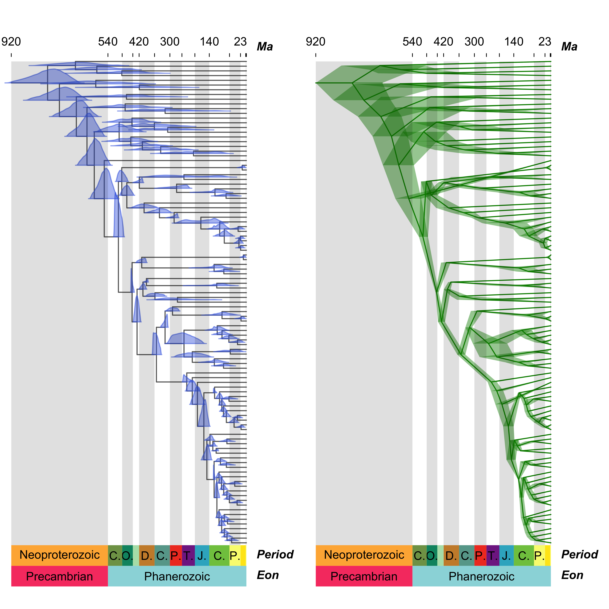
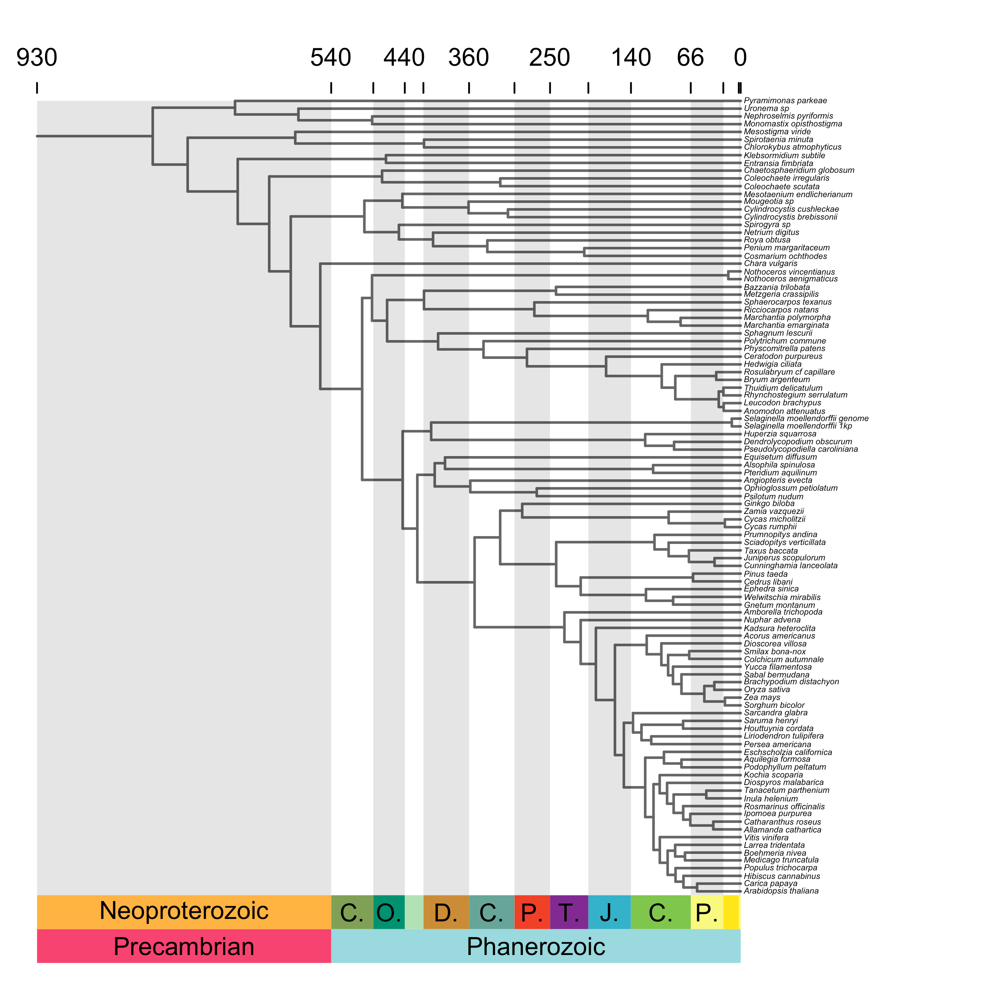
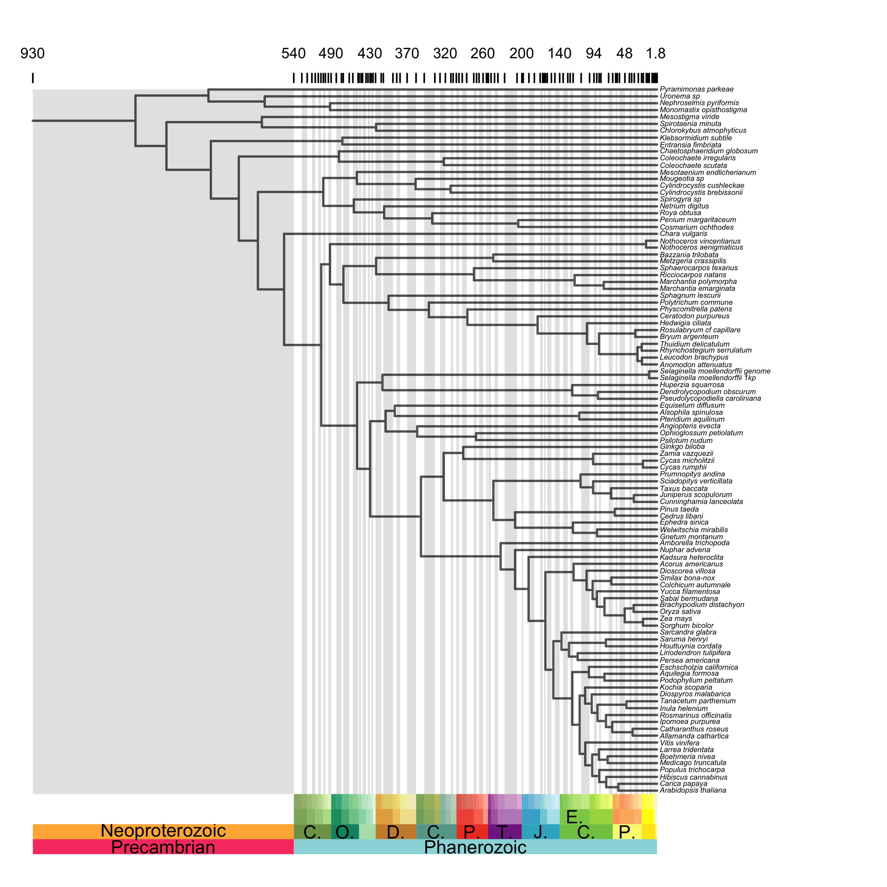
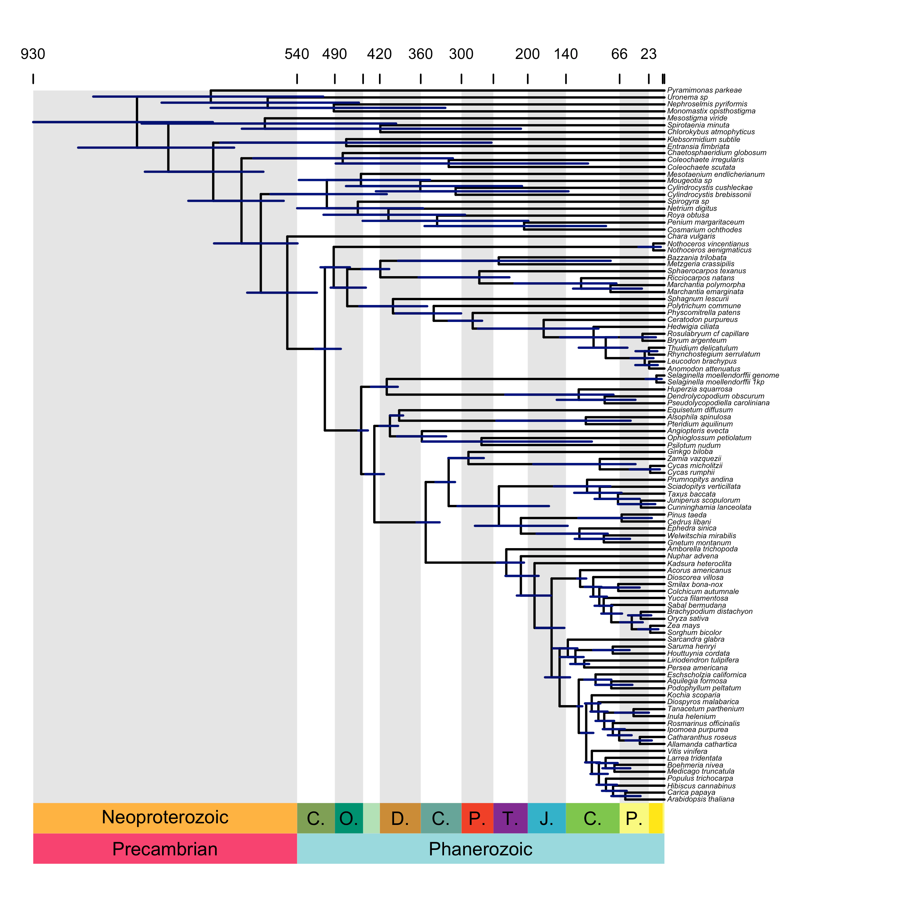
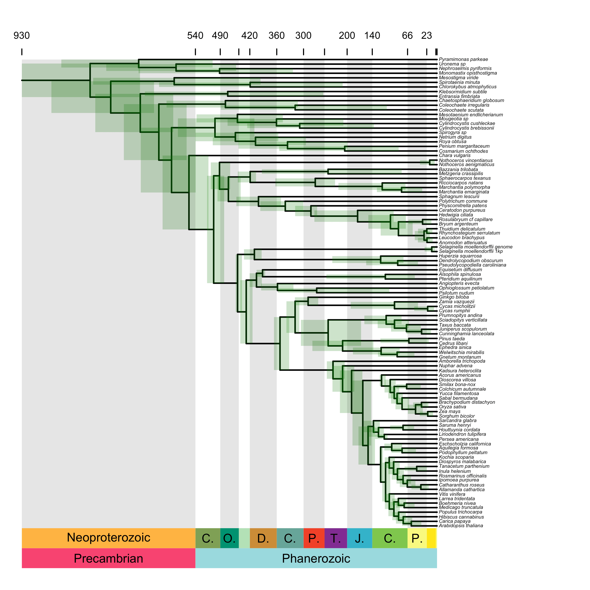
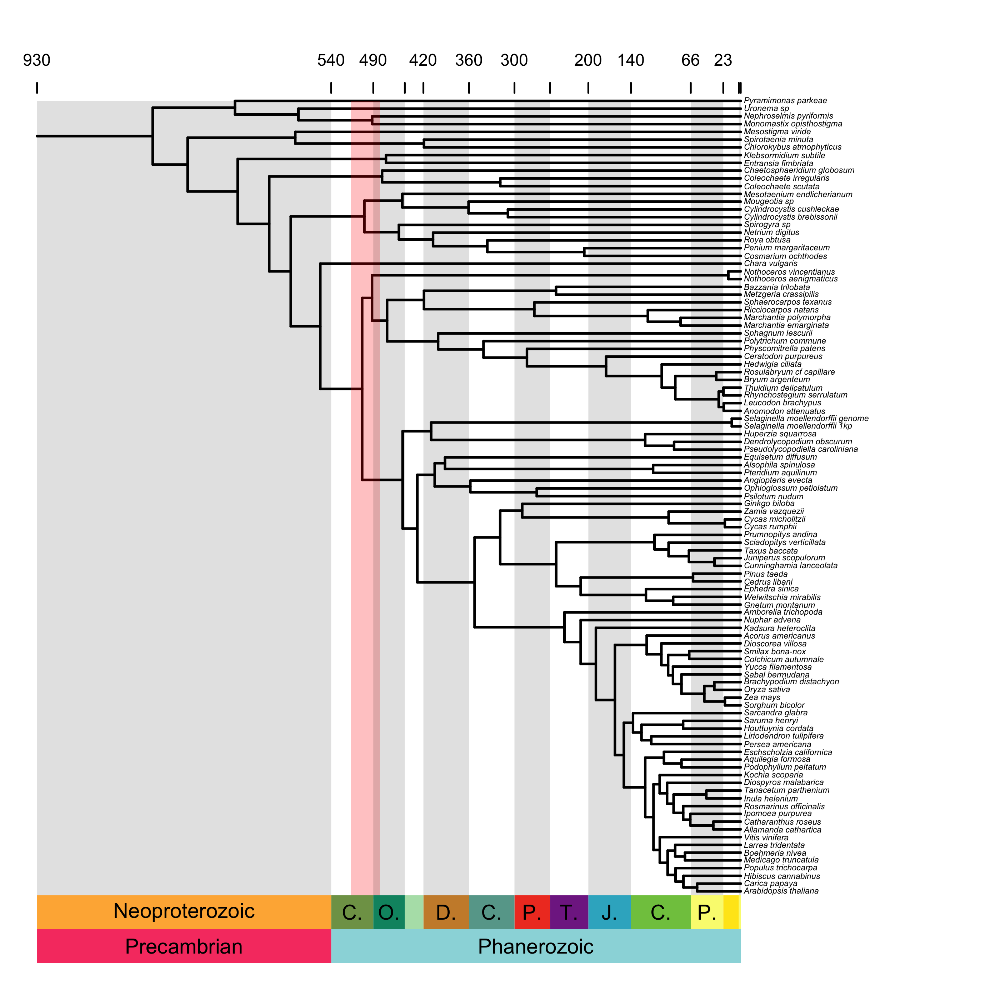
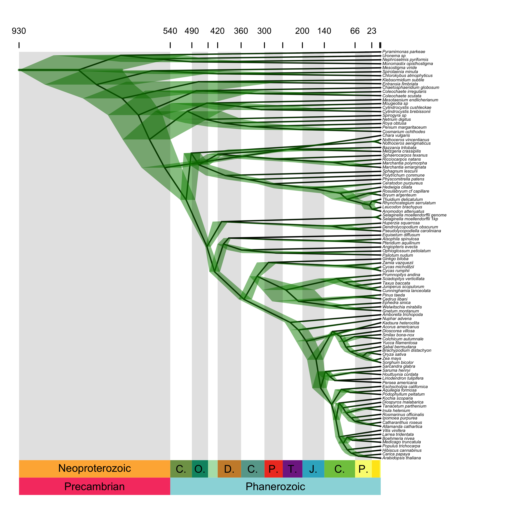
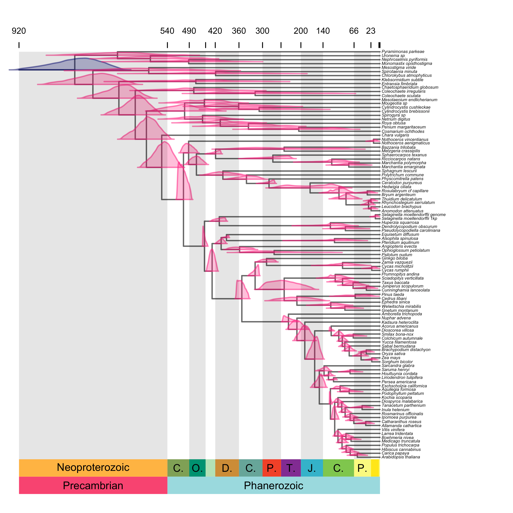
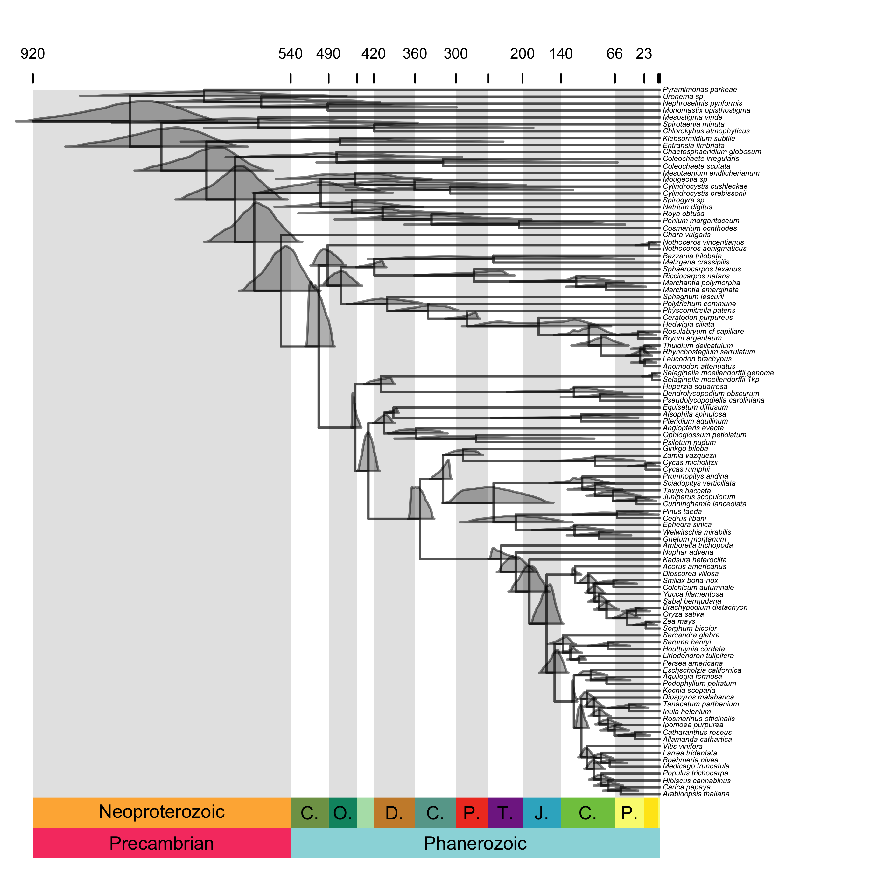

```{r, echo=FALSE, warning=FALSE, message=FALSE}
library(knitr)
opts_chunk$set(tidy.opts=list(width.cutoff=60),tidy=TRUE)
```

```{r global_options, include=FALSE}
knitr::opts_chunk$set(fig.pos = 'H')
```

```{r, fig.align='center', out.width="70%", out.height="70%", echo=FALSE, warning=FALSE, message=FALSE}
# par(mfrow=c(1,2))
# library(MCMCTreeR)
# data(mcmctree.output)
# attach(mcmctree.output)
# phy <- readMCMCTree(mcmctreer.phy, from.file=FALSE)
# mcmc.tree.plot(phy, mcmc.chain=mcmctree.posterior, time.correction=100, plot.type="distributions", cex.age=0.7, cex.labels=0.7, relative.height=0.08, col.tree="grey40", scale.res=c("Eon", "Period"), no.margin=TRUE, label.offset=4, density.col = "#4169E170", density.border.col = "#4169E190",  label.timescale.names=TRUE, tip.color="white",  cex.tips=0.1)
# mcmc.tree.plot(phy, mcmc.chain=mcmctree.posterior, time.correction=100, plot.type="cladogram", cex.age=0.7, cex.labels=0.7, relative.height=0.08, col.tree="#008b00", scale.res=c("Eon", "Period"), no.margin=TRUE, label.offset=4, col.age = "#008b0070", label.timescale.names=TRUE, tip.color="white",  cex.tips=0.1)
 
```


This guide demonstrates function to plot time trees output from divergence time analysis using the molecular (or morphological) clock. The functions include arguments to plot a geological and/or absolute timescale on the tree plot, and include uncertainity in node age estimate on the tree.

The function can take any timescaled tree from any software as long as it is read into R in [APE](https://cran.r-project.org/web/packages/ape/ape.pdf) format. The function contains methods to read in and summarise posterior age estimates for analyses from [MrBayes](http://nbisweden.github.io/MrBayes/), [RevBayes](https://revbayes.github.io/), and [MCMCtree](http://abacus.gene.ucl.ac.uk/software/paml.html). However **any** tree and uncertainty can be plotted the phylogeny and posterior age estimates are given as arguments to the function. 

# Installation

```{r, warning=FALSE, message=FALSE, eval=FALSE}
## check for devtools and install if necessary
if(!any(rownames(installed.packages()) == "devtools")) install.packages("devtools")
library(devtools)
install_github("PuttickMacroevolution/MCMCTreeR", quiet=TRUE)
```

The data in the examples here are taken from Morris **et al** 2018 from an MCMCtree divergence time analysis. These data are included in ``MCMCTreeR`` and are called using the ``data`` function. The object ``mcmctree.output`` contains a phylogeny output from MCMCtree ``mcmctreer.phy`` and a full posterior output from the analysis ``mcmctree.posterior``.

```{r, warning=FALSE, message=FALSE}
library(MCMCTreeR)
data(mcmctree.output)
attach(mcmctree.output)
names(mcmctree.output)
phy <- readMCMCTree(mcmctreer.phy, from.file=FALSE)
```

# Plot geological and absolute ages on plot

A timescale can be presented on the phylogeny plot. Different age designations can be displayed on the plot. Here Eon and Period are displayed in the plit. Furthermore, as ``add.time.scale`` is TRUE (the default) absolute ages are shown at the top of the plot. These ages reflect the ages for the last option in the arguement ``scale res``. So here absolute ages are shown for each Period at the top of the plot. As ``grey.bars`` is TRUE shaded is also used on the plot to delimit each Period.

```{r, eval=FALSE}
mcmc.tree.plot(phy, cex.tips=0.2, time.correction=100, scale.res=c("Eon", "Period"), plot.type="phylogram", cex.age=0.6, cex.labels=0.6, relative.height=0.08, col.tree="grey40", label.offset=4, node.method="none", no.margin=TRUE)
```

```{r, fig.align='center', out.width="70%", out.height="70%", echo=FALSE, warning=FALSE, message=FALSE, fig.cap='Phylogeny with posterior distributions of age on nodes and timescale',}

```

Here the same plot is shown with ``scale res`` set to shown all geological age options (Eon, Period, Epoch, Age), which looks too busy for this tree as it spans > 900 million years, but may be better for other trees


```{r, eval=FALSE}
mcmc.tree.plot(phy, cex.tips=0.2, time.correction=100, scale.res=c("Eon", "Period", "Epoch", "Age"), plot.type="phylogram", cex.age=0.4, cex.labels=0.5, relative.height=0.08, col.tree="grey40", label.offset=4, node.method="none", no.margin=TRUE)
```


```{r, fig.align='center', out.width="70%", out.height="70%", echo=FALSE, warning=FALSE, message=FALSE, fig.cap='Phylogeny with posterior distributions of age on nodes and timescale showing all units'}

```

# Plot node uncertainty

Timescaled phylogenies can be plotted as the default 'phylogram' type. On these phylogenies uncertainty can be plotted as node bars, similar to those used in [FigTree](http://beast.community/figtree). Note the argument ``time.correction`` is used to rescale the MCMCtree ages to absolute time by multiplying all ages by 100. Here node uncertainty is presented using bars to highight the upper and lower Highest Posterior Density of each age.

```{r, eval=FALSE}
mcmc.tree.plot(phy, analysis.type="mcmctree", cex.tips=0.2, time.correction=100, plot.type="phylogram", lwd.bar=2, scale.res=c("Eon", "Period"), node.method="bar", col.age="navy", no.margin=TRUE, label.offset=4)
```

```{r, fig.align='center', out.width="70%", out.height="70%", echo=FALSE, warning=FALSE, message=FALSE, fig.cap='Phylogeny with age uncertainty displayed as bars on nodes.'}

```

In this example, the age range of uncertainty for bars are spread across the vertical height of each node using the option ``node.length``.

```{r, eval=FALSE}
mcmc.tree.plot(phy, analysis.type="mcmctree", cex.tips=0.2, time.correction=100, plot.type="phylogram", lwd.bar=2, scale.res=c("Eon", "Period"), node.method="node.length", col.age="#008b0040", no.margin=TRUE, label.offset=4)
```

```{r, fig.align='center', out.width="70%", out.height="70%", echo=FALSE, warning=FALSE, message=FALSE, fig.cap='Phylogeny with age uncertainty displayed spanning the vertical height of the node.'}

```

Finally, bars can be displayed across the entire vertical range of the plot. This is useful if one node age is of particular interest. Here the age uncertainty for node 110 (embryophytes) is highlighted alone.

```{r, eval=FALSE}
mcmc.tree.plot(phy, analysis.type="mcmctree", cex.tips=0.2, time.correction=100, plot.type="phylogram", lwd.bar=2, scale.res=c("Eon", "Period"), node.method="full.length", all.nodes=110, col.age="#ff000040", no.margin=TRUE, label.offset=4)
```


```{r, fig.align='center', out.width="70%", out.height="70%", echo=FALSE, warning=FALSE, message=FALSE, fig.cap='Phylogeny with age uncertainty of one node spanning the height of the phylogeny.'}

```

## Mrbayes

The above examples were for MCMCtree analyses, these plots can also be produced for MrBayes trees. Here no tree object is provided but the full directory to the tree file is provided for the ``directory.files`` argument. This is then read in and plotted by the function.

```{r}
# directory.mb <- "/User/MrBayes/output.nex.con.tre"
# mcmc.tree.plot(analysis.type="mrbayes", directory.files=directory.mb, cex.tips=0.33, plot.type="phylogram", lwd.bar=2, add.time.scale=FALSE, node.method="bar", col.age="navy")
```

## RevBayes

RevBayes trees can read in the same way as MrBayes trees.

```{r}
# directory.rb <- "/User/RevBayes/output.nex.con.tre"
# mcmc.tree.plot(analysis.type="revbayes", directory.files=directory.rb, cex.tips=0.33, plot.type="phylogram", lwd.bar=2, add.time.scale=FALSE, node.method="bar", col.age="navy")
```

## Cladogram

For ``analysis.type`` 'mcmctree' node uncertainty can also be summarised using cladgoram plots with age uncertainty shown in the width of edge widths

```{r, eval=FALSE}
mcmc.tree.plot(phy, analysis.type="mcmctree", cex.tips=0.2, time.correction=100, plot.type="cladogram", lwd.bar=2, scale.res=c("Eon", "Period"), node.method="node.length", col.age="#008b0080", no.margin=TRUE)
```

```{r, fig.align='center', out.width="70%", out.height="70%", echo=FALSE, warning=FALSE, message=FALSE, fig.cap='Cladogram plot'}

```


# Plot full distribution on nodes

If the full posterior is supplied as well as the tree, the ``plot.type`` argument can be set to ``distributions`` to display the full distribution of age estimates for each node. The colour of the node distributions is set using ``density.col`` and ``density.border.col``.


```{r, eval=FALSE}
mcmc.tree.plot(phy, mcmc.chain=mcmctree.posterior, cex.tips=0.2, time.correction=100, plot.type="distributions", cex.age=0.4, cex.labels=0.5, relative.height=0.08, col.tree="grey40", scale.res=c("Eon", "Period"), no.margin=TRUE, label.offset=4, density.col = "#00000050", density.border.col = "#00000080")
```

```{r, fig.align='center', out.width="70%", out.height="70%", echo=FALSE, warning=FALSE, message=FALSE, fig.cap='Phylogeny with posterior distributions of age on nodes'}
knitr::include_graphics("MCMCtree_plot_fig/plot8.png")
```

Some nodes can be given different colours. For example, the root node here is coloured red and all other nodes are blue.

```{r, eval=FALSE}
node.colours <- rep("#ff008050", Nnode(phy$apePhy))
node.colours.border <- rep("#ff008090", Nnode(phy$apePhy))
node.colours[1] <- "#00008050"
node.colours.border[1] <- "#00008090"
mcmc.tree.plot(phy, mcmc.chain=mcmctree.posterior, cex.tips=0.2, time.correction=100, scale.res=c("Eon", "Period"), plot.type="distributions", cex.age=0.4, cex.labels=0.5, relative.height=0.08, col.tree="grey40", col.age="black", density.col=node.colours, density.border.col=node.colours.border, grey.bars = TRUE, no.margin=TRUE)
```

```{r, fig.align='center', out.width="70%", out.height="70%", echo=FALSE, warning=FALSE, message=FALSE, fig.cap='Phylogeny with posterior distributions of age on nodes, with the root a different colour'}

```


# Plot tree and timescale from any software

Using the 'user' option in the argument ``analysis.type`` it is possible to plot trees, timescales, and age uncertainty, with files output from any software. 

The function only needs to be provided with a time-scaled phylogeny, and the full posterior age estimates for each node. This user input information is provided as a list to the argument ``node.ages``.

For this example, we are using the MCMCtree output, but the process should be applicable to any divergence time software output. The ``mcmc.tree.plot`` function requires that the object ``node.ages`` is organised so the each element contains information for nodes as they appear in the second column of the APE tree$edge object. The first element in the list supplied to ``node.ages`` is the root node. The function then requires that each element is named using the node order as they appear in the second column of the APE edge object.

Here the 'user' approach is set-up step-by-step. First we store the tree in APE format as a new object, and also create a new object for the ``phy$edge`` object which stores the tree structure in APE matrix format. Finally the mcmc chain is stored as a new object.

```{r, eval=FALSE}
phy <- phy$apePhy
phy.edge <- phy$edge
mcmc.chain <- mcmctree.posterior
```

We now need to know how the output nodes from MCMCtree mcmc chain correspond to the labels in APE. For MCMCtree they are equivalent in that internal node labels start at the root as number of tips + 1, and then increase. For other software outputs this may need more investigation; plotting the tree with the APE function ``nodelabels()`` can help. In the MCMCtree output file, node ages are stored in the second column onwards. So we extract these data and then remove the 't_n' label from each column header so we are left with just the node numbers. We then re-arrange the list so the information for each node from the MCMCtree output matches the node order in APE, and name each element in the ``node.ages`` list using the APE node labels.

```{r, eval=FALSE}
# Not run. Plot tree with node labels to help work out how labels correspond to tree from software output.
## plot(ape)
## nodelabels()
# extract ages with node age posteriors from column 2
mcmc.node.ages <- mcmc.chain[,2:Ntip(phy)]
# extract the names from these data so they are numeric node labels that match the APE tree format
all.nodes <- as.numeric(gsub("t_n", "", colnames(mcmc.node.ages)))
# create a vecotr of names for each list element as internal nodes from APE tree, using phy$edge object.
node.ages.names <- c(Ntip(phy) +1, phy.edge[which(phy.edge[,2] > Ntip(phy)),2])
# find where each posterior node age appears in APE edge object.
match.nodes <- match(all.nodes, as.numeric(node.ages.names))
# create a list extracting the information from the mcmc chain in APE node order.
node.ages <- lapply(match.nodes, function(uu) mcmc.node.ages[,uu])
# name each element in list.
names(node.ages) <- node.ages.names
```

The ``node.ages`` object is input to ``mcmc.tree.plot`` with the argument ``analysis.type`` set to 'user' to plot the timescaled tree and node uncertainty

```{r, eval=FALSE}
mcmc.tree.plot(phy=phy, node.ages=node.ages, analysis.type="user", cex.tips=0.2, time.correction=100, scale.res=c("Eon", "Period"), plot.type="distributions", cex.age=0.4, cex.labels=0.5, relative.height=0.08, col.tree="grey40", no.margin=TRUE)
```

```{r, fig.align='center', out.width="70%", out.height="70%", echo=FALSE, warning=FALSE, message=FALSE, fig.cap='Phylogeny plotted with user-formatted data'}

```

**References**

* Morris JL, Puttick MN, Clark JW, Edwards, Kenrick PD, Pressel S, Wellman CH, Yang Z, Schneider H, and Donoghue PCJ. 2018. The timescale of early land plant evolution. **Proceedings of the National Academy of Sciences USA**. (https://doi.org/10.1073/pnas.1719588115)